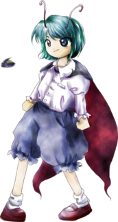

# recordName

> This is the feed's ID which can be letters, numbers, or dashes. Spaces are not allowed. Maximum length is 15 characters.

wriggle-nightbug

# displayName

> This is the title of the custom feed. Maximum length is 24 characters.

Wriggle Nightbug

# description

> 

All the coolest wriggle nightbug stuff posted on this site. The wriggle bugs may not be verified for sfw or not. Please be cautious Non-wrigglebugs may show themselves, pay them no mind. Artificial Insect 
(AI) artists will be blocked. Please report them to me.

# searchTerms

> There are three types of search terms:
>
> - Keywords: Test these in [https://bsky.app/search](https://bsky.app/search). `AND` is implicit, so `cat dog` on one line will require both `cat` and `dog`. You can use quotes as well `"hot dog"`.
> - Users: links such as `https://bsky.app/profile/why.bsky.team` will pull in the user's posts. To include replies and reposts, you can add the following flags: `https://bsky.app/profile/why.bsky.team +replies +reposts`.
> - Pinned posts: links such as `https://bsky.app/profile/saddymayo.bsky.social/post/3jxju2wwap22e` will pin at the top of the feed. One link per line, please.

- https://bsky.app/profile/wrigglenightbug.com/post/3l5fpskizhn2u
- wriggle nightbug
- リグル・ナイトバグ
- リグルナイトバグ
- wriggle touhou
- wriggle 東方project
- リグル 東方project
- リグル 東方
- https://bsky.app/profile/wrigglenightbug.com
- https://bsky.app/profile/shanghai-alice.com

# denyList

> Deny list will exclude any results from a given user. You can provide the username or DID.
>
> - did:plc:1234
> - @spamspamspam.bsky.social
- https://bsky.app/profile/niwatoriobake.bsky.social

# safeMode

> Safe mode limits the total number of API calls coming from Cloudflare.
>
> Set to `false` if you have higher limits via a paid Cloudflare plan.

true

# avatar

> This must link to an image (PNG or JPEG) in the same directory as this CONFIG.md. It doesn't have to be called `avatar.png`, but just be sure this CONFIG.md points to the correct file.

